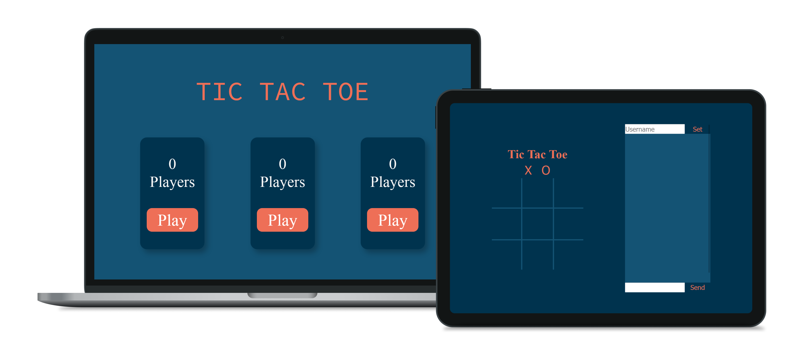

[](https://tic-tac-toe-online-2p.herokuapp.com/)<br />

<p align="center">

  <h3 align="center">Crown World</h3>

  <p align="center">
    An E-commerce Website
  </p>
</p>


<!-- TABLE OF CONTENTS -->
## Table of Contents

* [About the Project](#about-the-project)
  * [Built With](#built-with)
* [Getting Started](#getting-started)
  * [Prerequisites](#prerequisites)
* [License](#license)
* [Contact](#contact)


<!-- ABOUT THE PROJECT -->
## About The Project

I originally made this website to learn React, Redux and Firestore. I later rebuild it from scratch with react hooks so that the code is improved.

### Built With
* [Node.js](https://nodejs.org)
* [Express.js](https://expressjs.com)
* [Socket.IO](https://socket.io)
* [EJS](https://ejs.co)

## Getting Started

To get a local copy up and running follow these simple example steps.

### Prerequisites

* npm

On the root folder run:
```sh
npm install
npm start
```

## License

Distributed under the MIT License. See `LICENSE` for more information.

## Contact
lucasmercado101@gmail.com

Project Link: https://github.com/Lucasmercado101/online-tic-tac-toe-game
